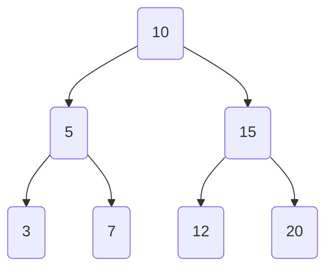
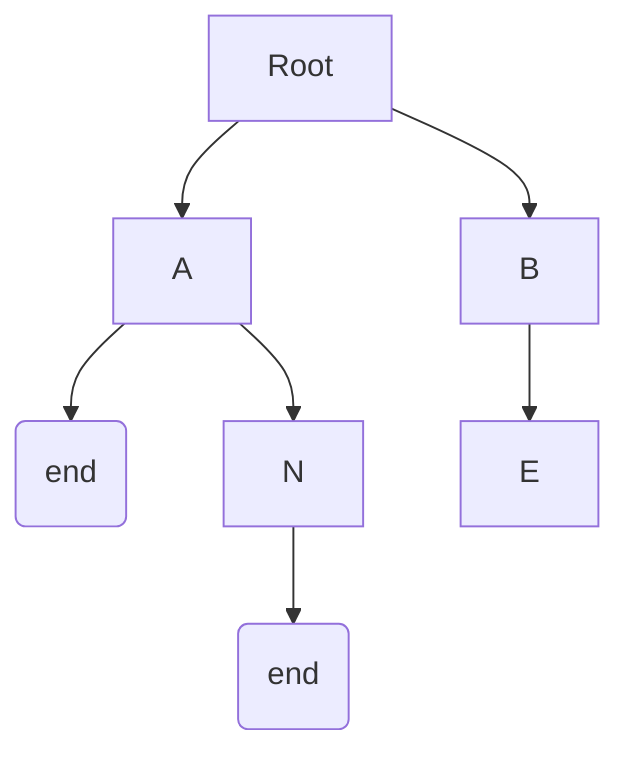

# Executive Summary  
Data structures are fundamental tools for organizing and storing data to enable efficient access and modification. In computer science, a *data structure* is a **collection of data values**, along with the relationships among them and the operations that can be performed【15†L198-L202】. Choosing an appropriate data structure is crucial for application performance: for example, relational databases commonly use **B‑trees** for indexing, while language implementations often use **hash tables** for symbol lookup【15†L213-L221】. This document provides a *comprehensive catalogue* of data types and data structures — from primitives and composites to abstract and advanced structures — with concise definitions, real-world examples, key operations and their time complexities, and idiomatic initialization in C++, Java, Python, and JavaScript. Each section includes pointers to authoritative sources and diagrams (ASCII or Mermaid) to aid understanding.

# Table of Contents  
- [Data Types](#data-types)  
  - [Primitive Types](#primitive-types)  
  - [Composite Types](#composite-types)  
- [Abstract Data Types (ADT)](#abstract-data-types-adt)  
  - [List](#list-adt)  
  - [Associative Array / Map / Dictionary](#associative-array-map-dictionary)  
  - [Set / Multiset](#set-adt)  
  - [Stack (LIFO)](#stack-adt)  
  - [Queue / Deque (FIFO)](#queue-and-deque-adt)  
  - [Graph (Nodes & Edges)](#graph-adt)  
- [Linear Data Structures](#linear-data-structures)  
  - [Array (Static / Dynamic)](#array)  
  - [Bit Array / Bitmap](#bit-array-bitmap)  
  - [Linked List (Singly/Doubly/Circular)](#linked-list)  
  - [XOR Linked List](#xor-linked-list)  
  - [Skip List](#skip-list)  
- [Tree Structures](#trees)  
  - [Binary Tree & Binary Search Tree](#binary-tree-and-bst)  
  - [Balanced BSTs: AVL, Red-Black, Scapegoat, Splay, Treap](#balanced-bsts)  
  - [Treap (Tree + Heap)](#treap)  
  - [Splay Tree](#splay-tree)  
  - [B-Tree and B+ Tree](#b-tree-and-b-tree)  
  - [2-3-4 Trees](#2-3-4-tree)  
  - [Heap Variants (Binary, Binomial, Fibonacci)](#heaps)  
  - [Trie (Prefix Tree)](#trie)  
  - [Suffix Tree and Suffix Array](#suffix-structures)  
  - [Segment Tree](#segment-tree)  
  - [Fenwick Tree (Binary Indexed Tree)](#fenwick-tree)  
  - [QuadTree / Octree / k-d Tree / Range Tree / Interval Tree](#specialized-trees)  
- [Hash-Based Structures](#hash-based-structures)  
  - [Hash Table / Hash Map / Hash Set](#hash-table-hashmap)  
  - [Bloom Filter and Cuckoo Filter](#bloom-filter)  
  - [Count–Min Sketch](#count-min-sketch)  
  - [Other Hash Structures (DHT, HAMT, etc.)](#other-hash)  
- [Graphs](#graphs)  
- [Other & Specialized Structures](#other-structures)  
  - [Disjoint Set (Union-Find)](#disjoint-set-union-find)  
  - [Rope (String Data Structure)](#rope)  
  - [Finger Tree, Rope, LSM-tree, etc.](#misc-structures)  
- [Comparisons and Use-Cases](#comparisons-and-use-cases)  
  - [Complexity Comparison Table](#complexity-comparison)  
  - [Use-Case Examples](#use-case-examples)  
- [Completeness Checklist (Wikipedia Mapping)](#completeness-checklist)  

# Data Types  
Data *types* are categories that determine what values data can take and what operations are allowed. They include **primitive types**, which are built-in simple data like integers and booleans, and **composite types** (structures of other types). Languages also support **abstract data types (ADTs)** — logical interfaces like “List” or “Map” — usually implemented by one or more concrete data structures. In C++, Java, Python, and JavaScript we have the following:

## Primitive Types  
Basic (atomic) data types typically include:  
- **Boolean**: true/false (e.g. `bool flag = true;`)【1†L155-L163】.  
- **Integer**: whole numbers (`int a = 42;`, `long` in Java, Python’s `int` is unbounded)【1†L160-L163】.  
- **Floating-point**: real numbers (`float b = 3.14f;`, `double b = 3.14;` in C++; `float` in Java, `float` in Python, `number` in JS)【1†L157-L163】.  
- **Character**: single letters (`char c = 'A';`) or Unicode code points (Java `char`, Python `str` of length 1)【1†L155-L163】.  
- **String**: sequence of characters (in C++: `std::string`, Java: `String`, Python: `str`, JS: `String`).  
- **Null / None**: empty value (`nullptr` in C++, `null` in Java/JS, `None` in Python).  
- **Undefined / Symbol**: (JS has `undefined`, `Symbol`, `BigInt`).  
- **Pointer / Reference**: C++ has pointers (`int *p`), Java uses references (no explicit pointers), Python/JS variables are references to objects【1†L163-L169】.  

*Example snippet:*  
```cpp
int i = 10;    // C++ integer
double d = 2.718;
char c = 'X';
bool flag = false;
```
```java
int i = 10;   // Java primitive int
double d = 2.718;
char c = 'X';
boolean flag = false;
String s = "hello";
```
```python
i = 10          # Python int
d = 2.718       # float
c = 'X'         # str (length 1)
flag = False    # bool
s = "hello"     # str
```
```javascript
let i = 10;        // number
let d = 2.718;     // number
let c = 'X';       // string (JS has no char type)
let flag = false;  // boolean
let s = "hello";   // string
let sym = Symbol("id");  // Symbol
let big = 123n;    // BigInt
```

## Composite Types (Structures & Classes)  
Composite (non-primitive) types are aggregates of other types. Key examples:  
- **Array**: a sequence of elements of the same type stored contiguously【2†L236-L243】. (e.g. C++ `int arr[3]`, Java `int[] arr = {...}`, Python `list`, JS `Array`).  
- **Struct/Record/Class (Object)**: collection of named fields (C++ `struct`, Java `class`, Python `class`). Example: `struct Point { int x, y; };`. In Python/JS classes and objects serve this purpose.  
- **Union / Variant**: a container that may hold one of several types at a time (C/C++ `union`, languages like Java may simulate this with class hierarchies or `Optional`/sum types).  
- **String (Composite)**: a sequence of characters (immutable in Java/Python, mutable in C++ `std::string`).  
- **Tuple (Product type)**: fixed-size collection of possibly different types (C++ `std::tuple`, Python `tuple`, Java can use `Pair` or `List` of fixed size).  

*Note:* Primitive types can often be thought of as atomic, whereas composite types build larger structures (e.g. arrays of primitives, classes of primitives). The details (e.g. static vs dynamic array) may vary by language.

# Abstract Data Types (ADT)  
An *abstract data type* defines the logical behavior of a data structure (operations, ordering, uniqueness, etc.) without specifying the implementation【2†L204-L214】. Common ADTs include:  

- **List (Sequence)**: ordered collection; duplicates allowed. Operations: index access, insert, delete.  
- **Associative Array / Map / Dictionary**: collection of (key, value) pairs with unique keys. Operations: lookup, insert, delete by key.  
- **Multimap**: like map, but multiple values per key.  
- **Set / Multiset (Bag)**: collection of unique (set) or not necessarily unique (bag) unordered elements. Operations: membership, insert, delete.  
- **Stack**: LIFO (last-in-first-out) structure. Operations: push, pop, peek (top). (See [Stack (ADT)](#stack-adt)).  
- **Queue**: FIFO (first-in-first-out) structure. Operations: enqueue, dequeue, peek. (See [Queue (ADT)](#queue-and-deque-adt)).  
- **Deque (Double-Ended Queue)**: allows insertion/removal at both ends.  
- **Graph**: set of nodes (vertices) connected by edges. (See [Graph (ADT)](#graph-adt)).  
- **Tree**: hierarchical structure of nodes. (See [Tree Structures](#trees)).  

**Example (List ADT):**  
Think of a *playlist* of songs where order matters and songs can repeat. You can insert a song at any position, or remove one.  

# Abstract Data Type Definitions and Sources  
A *data structure* implements one or more ADTs. For example, a hash table implements the associative array ADT: each key maps to a value, and lookup/insertion can be done in average **constant time**【28†L223-L231】. The table below summarizes ADT properties【2†L206-L214】:

| Structure (ADT)           | Ordered? | Duplicates allowed?      | Typical Implementation             |
|---------------------------|----------|--------------------------|------------------------------------|
| List (Sequence)           | Yes      | Yes (allows equal items) | Array, Linked List, Balanced BST   |
| Associative Array / Map   | No       | Keys unique, values can repeat | Hash table, Tree Map, List of pairs |
| Set                       | No       | No                       | Hash table, Tree Set               |
| Multiset (Bag)           | No       | Yes                      | Hash table (multiset), list       |
| Stack                     | Yes (LIFO)| Yes (same item multiple pushes) | Array-based stack, linked list  |
| Queue (FIFO)              | Yes (FIFO)| Yes                      | Linked list or circular array      |

*(Ordered? means whether there is a defined ordering of elements).*

# Linear Data Structures  
**Linear** structures arrange elements in sequence, one after another. This category includes arrays, lists, and their variants.

## Array  
An *array* is a contiguous block of memory storing elements of the same type【2†L236-L243】. Access by index is very fast (O(1)), but inserting or removing elements in the middle requires shifting O(n) elements. Common variants:  
- **Static Array**: fixed size (C/C++ `int a[10];`).  
- **Dynamic Array** (resizable array): automatically grows as needed (C++ `std::vector`, Java `ArrayList`, Python `list`, JS `Array`). For dynamic arrays, appending is amortized O(1) (because they occasionally resize)【9†L324-L332】.  
- **Bit Array (Bitmap)**: array of bits (0/1) for compact storage (e.g. Python’s `bitarray` module or using `std::vector<bool>`). Useful for bloom filters or occupancy grids.

*Example & Diagram:*  
In C++: `std::vector<int> A = {1,2,3};` allows random access `A[1]` in constant time【9†L324-L332】.  

```cpp
int arr[3] = {1, 2, 3};             // static array
std::vector<int> vec = {1, 2, 3};   // dynamic array (std::vector)
```
```java
int[] arr = {1, 2, 3};              // static array
ArrayList<Integer> list = new ArrayList<>(Arrays.asList(1,2,3)); // dynamic array
```
```python
arr = [1, 2, 3]                     # Python list (dynamic array)
```
```javascript
let arr = [1, 2, 3];                // JS Array (dynamic array)
```

**Operations and Complexity:**  
- **Access by index:** O(1).  
- **Search:** O(n) linear scan (unless array is sorted, binary search O(log n)).  
- **Insert/Delete at end:** O(1) amortized (for dynamic array)【9†L324-L332】.  
- **Insert/Delete at index:** O(n) (elements shifted).  

**Use-case:** Ideal for random-access tasks, stacks (if only push/pop at end), and static data like look-up tables.

## Bit Array / Bitmap  
A bit array is a compact array of bits (0/1). Operations typically include setting or clearing a bit and testing a bit. Useful for memory-efficient flags or bloom filters. No direct built-in in some languages (C++ can use `std::vector<bool>` or `std::bitset`, Java has `BitSet`, Python can use `bitarray`, JS can use typed arrays).  

```
# Conceptual depiction of a bit array:
Index:   0 1 2 3 4 5
BitVal: [1 0 0 1 1 0]
```

**Operations:** Set/Clear a bit (O(1)), count bits (O(n) or via specialized CPU instruction).  
**Use-case:** Bloom filters, occupancy grids, flags.

## Linked List  
A linked list is a sequence of nodes, each pointing to the next (and possibly previous) node. Variants: singly-linked (one pointer to next), doubly-linked (pointers both ways), circular (last node links to first). Unlike arrays, insertion/removal at the ends or with a known node pointer is O(1). But random access is O(n)【19†L313-L321】.  

*Example (Singly-linked):*  

```cpp
struct Node { int data; Node* next; };
Node* head = new Node{1, nullptr};
head->next = new Node{2, nullptr};
```
```java
LinkedList<Integer> list = new LinkedList<>();
list.add(10);  // LinkedList.add() to end
```
```python
from collections import deque
list = deque([10, 20])   # Python deque used as doubly-linked list
```
```javascript
// No native linked list in JS; one can simulate via objects:
class ListNode { constructor(val){ this.val = val; this.next = null; } }
```

**Operations and Complexity:**  
- **Access by index:** O(n) (must traverse)【19†L313-L321】.  
- **Search:** O(n) (linear).  
- **Insert/Delete at head (singly) or tail (doubly):** O(1).  
- **Insert/Delete given a node:** O(1) (splicing pointers)【19†L313-L321】.  

**Diagram (Singly-Linked List):**  
```
head -> [1 | *] -> [2 | *] -> [3 | null]
```
(* points to next node)

**Use-case:** Frequent insertions/deletions, implementing stacks/queues (though arrays are often simpler), adjacency lists in graphs.

## XOR Linked List  
A memory-efficient linked list where each node stores the XOR of next and previous addresses, saving space at cost of complexity. Rarely used; not directly supported in high-level languages. In C/C++ you can implement node with `Node* both;` storing XOR of next and prev pointers.  
  
*No standard library implementation exists.*

## Skip List  
A **skip list** is a probabilistic structure built on sorted linked lists with multiple “levels” that allow fast search【11†L176-L184】. Each element is in the base level, and higher levels contain a subset of elements, creating “express lanes” for faster search (like a multi-level linked list). On average, skip lists achieve **O(log n)** search, insert, and delete【11†L176-L184】, though worst-case is O(n).  

```python
# (Conceptual pseudo-implementation idea)
class SkipNode:
    def __init__(self, val): self.val=val; self.forward=[]
class SkipList:
    # skip list with probabilistic level choices
    pass
```

**Diagram (conceptual):**  
Mermaid graph of a 4-element skip list (A, B, C, D):

```mermaid
graph LR
    subgraph Level 2 (top)
        A2[A] --> C2[C]
    end
    subgraph Level 1
        A1[A] --> B1[B] --> C1[C] --> D1[D]
    end
    subgraph Level 0 (bottom, full list)
        A0[A] --> B0[B] --> C0[C] --> D0[D]
    end
```

**Operations:**  
- **Search/Insert/Delete:** average O(log n)【11†L176-L184】, worst-case O(n) (rare, if random levels degenerate).  
- Built by assigning each element a random height; higher-level pointers skip multiple nodes.

**Note:** No built-in in standard libraries. Implementation is usually custom or via specific libraries (e.g. [Java’s `ConcurrentSkipListMap`](https://docs.oracle.com/javase/8/docs/api/java/util/concurrent/ConcurrentSkipListMap.html)).

# Tree Structures  
Trees are hierarchical data structures with a root and child nodes. They are widely used (e.g. file systems, database indexes). All trees are acyclic graphs【2†L228-L234】. Key types:

## Binary Tree and Binary Search Tree (BST)  
A *binary tree* has nodes with at most two children (left and right). A **Binary Search Tree (BST)** is a binary tree where left subtree < node < right subtree, enabling search and sorted operations.  




**Operations (BST):** search, insert, delete. Time complexities depend on balance: average O(log n), worst-case O(n) if degenerate (chain).  
**Use-case:** keep a sorted dynamic set of items with near-logarithmic operations.

**Sample code:**  
```cpp
struct Node { int val; Node* L; Node* R; };
Node* root = new Node{10, nullptr, nullptr};
```
```java
class Node { int val; Node left, right; }
Node root = new Node(10);
```
```python
class Node:
    def __init__(self, val): self.val=val; self.left=None; self.right=None
root = Node(10)
```
```javascript
class Node { constructor(val){ this.val = val; this.left=null; this.right=null; } }
let root = new Node(10);
```

**Balanced Variants:** (below)

## Balanced BSTs: AVL, Red-Black, Scapegoat, Splay, Treap  
These are self-balancing binary search trees that guarantee O(log n) height.

- **AVL Tree**: Strictly balanced BST; rotates to maintain height balance. Guarantees O(log n) search/insert/delete.  
- **Red-Black Tree**: BST with color bits enforcing balance. Common in language libraries (Java’s `TreeMap`, C++ `std::map`).  
- **Scapegoat Tree**: Rebuilds unbalanced subtrees on demand.  
- **Splay Tree**: Self-adjusting BST; recently accessed elements are splayed to root. Amortized O(log n), worst-case O(n). Good for access patterns with locality.  
- **Treap**: Randomized BST that also acts as a heap on priority values. Expected O(log n).

No standard code snippets; implementations are custom.  
**Library Notes:** Java’s `TreeMap` is a Red-Black Tree; C++ `std::map`/`std::set` are typically Red-Black; Python has no built-in balanced tree (use `sortedcontainers` or write your own).

## Heap (Priority Queue)  
A *heap* is a tree (often implemented as an implicit binary tree in an array) where each parent node has priority ≥ (max-heap) or ≤ (min-heap) its children. Used to implement priority queues. Variants include:
- **Binary Heap**: common implementation (array-based).  
- **Binomial Heap**, **Fibonacci Heap**: support faster decrease-key or meld, used in advanced algorithms (like Dijkstra’s).  
- **Min-Max Heap**, **Leftist Heap**, etc.

**Operations:**  
- **Insert:** O(log n) (heapify-up).  
- **Find min/max:** O(1).  
- **Extract min/max:** O(log n) (heapify-down).  
These are average and worst-case complexities (no amortized intricacies as in dynamic array).  

*Example (C++ `priority_queue` uses a max-heap by default):*  
```cpp
priority_queue<int> maxh;  
maxh.push(5); maxh.push(1); maxh.push(8);
int top = maxh.top(); // 8
```
```java
PriorityQueue<Integer> minHeap = new PriorityQueue<>(); // min-heap by default
minHeap.add(5); minHeap.add(1); minHeap.add(8);
int min = minHeap.peek(); // 1
```
```python
import heapq
heap = []
heapq.heappush(heap, 5)
heapq.heappush(heap, 1)
min_val = heap[0]  # 1
```
```javascript
// No native heap; one can simulate with a sorted array or write a binary heap class.
```

**Use-case:** Scheduling tasks by priority, Dijkstra’s algorithm (Fibonacci heap), sorting (heap sort).

## B-Tree and B+ Tree  
**B-Trees** are multi-way search trees used in databases and filesystems for block storage. Each node holds multiple keys (order d) and has many children, keeping depth small. **B+ Tree** is a variant where all values are in the leaf nodes and internal nodes only guide search. Both maintain sorted order and allow blockwise I/O efficiency.

- **Operations:** search/insert/delete O(log n) (where n is number of keys) because height is kept low.  
- **Use-case:** Disk-based indexing (MySQL, filesystems).

*No built-in in these languages*, but e.g. C++ can use Boost B-tree or external libraries. See Wikipedia for details.

## Trie (Prefix Tree)  
A *trie* is a tree for storing strings by characters; each edge represents a character. All descendants of a node share a prefix. Searching for a string of length k takes O(k). Common for auto-completion or IP routing tables.  

```cpp
struct TrieNode { 
    bool end;
    unordered_map<char, TrieNode*> children;
};
TrieNode* root = new TrieNode();
```
```java
class TrieNode { 
    boolean end; 
    Map<Character,TrieNode> children = new HashMap<>();
}
```
```python
class TrieNode:
    def __init__(self): self.end=False; self.children={}
root = TrieNode()
```
```javascript
// No native Trie; can use objects/maps:
class TrieNode { constructor(){ this.end=false; this.children=new Map(); } }
```

```
diagram: Trie for words "cat", "car", "dog":
      (root)
      /  | 
     c   d
    /     \
   a       o
  / \       \
 t   r       g
```

**Operations:** insert/search O(k) where k = length of key. Space can be large (fan-out of alphabet).

## Segment Tree  
A *segment tree* is a binary tree used for interval queries (like sum/min over array segments). Built on an array of size n in O(n), supports query/update in O(log n). Each node represents a segment of the array.  

*Basic Idea:* Build a tree where leaves are array elements, and internal nodes combine children (sum/min).  

```python
# Pseudocode structure
segtree = [0] * (4*n)
def build(node, l, r): ...
def query(node, l, r, ql, qr): ...
def update(node, l, r, idx, val): ...
```

**Use-case:** Range sum/min queries with updates (competitive programming, some graphics/games).

## Fenwick Tree (Binary Indexed Tree)  
A Fenwick tree is an implicit binary tree in an array that efficiently computes prefix sums and supports updates【13†L143-L151】. For an array of size n, it uses O(n) space. Query (prefix sum) and update operations are **O(log n)**【13†L137-L145】.  

```cpp
vector<int> bit(n+1, 0);
auto update = [&](int i, int val){
    for(; i<=n; i += i & -i) bit[i] += val;
};
auto prefix_sum = [&](int i){
    int sum=0;
    for(; i>0; i -= i & -i) sum += bit[i];
    return sum;
};
```
```java
// Similar concept in Java, no built-in class.
```
```python
# Fenwick functions
def update(bit, i, val):
    while i < len(bit):
        bit[i] += val; i += i & -i
```
**Concept:** Fenwick tree is essentially a tree over array indices that stores partial sums, enabling updates and prefix queries in O(log n)【13†L143-L151】. Commonly used for frequency tables, range sum queries.

## Suffix Tree and Suffix Array  
- **Suffix Tree:** A compressed trie of all suffixes of a string. Allows substring search in O(m) time (m = pattern length) after O(n) build (Ukkonen’s algorithm). Memory-heavy (O(n) space).  
- **Suffix Array:** Sorted array of all suffix indices of a string. Allows binary-search based substring queries in O(m log n). Uses less memory than a suffix tree.

*Use-case:* String matching, bioinformatics (e.g. finding repeats). Implementation is complex; not built-in.

# Hash-Based Structures  
Hash structures use a hash function to map keys to buckets for fast access. 

## Hash Table / Hash Map / Hash Set  
A **hash table** stores key-value pairs (a map/dictionary) or just keys (in a set) using hashing【28†L212-L220】.  

- C++: `std::unordered_map<Key,Val>`, `std::unordered_set<Key>`.  
- Java: `HashMap<Key,Val>`, `HashSet<Key>`.  
- Python: `dict` (maps), `set`.  
- JavaScript: `Map`, `Set` (ES6) or plain `Object` as a map (string keys).  

**Operations:** Lookup, insert, delete – average **O(1)**, worst-case **O(n)** when collisions degrade【28†L204-L209】. In practice, implementations resize to keep load factor low.  
Example:  

```cpp
#include <unordered_map>
unordered_map<string,int> freq;
freq["apple"] = 5;
```
```java
HashMap<String,Integer> freq = new HashMap<>();
freq.put("apple", 5);
```
```python
freq = {"apple": 5}
freq["banana"] = 2
```
```javascript
let freq = new Map();
freq.set("apple", 5);
```

**Use-case:** Most dictionary lookups, caching, database indexing, and when average-case speed is key. See [Hash table (Wikipedia)](#) for details on complexity【28†L204-L209】.

## Bloom Filter  
A *Bloom filter* is a probabilistic data structure for set membership. It uses multiple hash functions and a bit array. Insert: set bits; Query: check all bits. False positives possible (≈5%), but no false negatives. Space-efficient.  
No standard library classes, but can implement using bit arrays and hashes.  

## Cuckoo Filter  
An improvement on Bloom filter that supports deletion. Uses cuckoo hashing on bits. Not standard in libraries; often custom or research use.

## Count–Min Sketch  
A probabilistic structure for frequency estimation of items. Uses multiple hash tables (arrays) to keep counts with possible overestimates. Useful in streaming/big-data contexts. Not standard; can be implemented via arrays and hash functions.

# Graphs  
A *graph* consists of vertices (nodes) and edges (connections). Can be **directed** or **undirected**, **weighted** or **unweighted**.  

**Representations:**  
- **Adjacency List:** A list of neighbors for each vertex (common for sparse graphs).  
- **Adjacency Matrix:** A 2D matrix marking edges (common for dense graphs).  

```cpp
int V = 5;
vector<vector<int>> adj(V);
adj[0] = {1,2};  // edges 0->1, 0->2
```
```java
List<List<Integer>> adj = new ArrayList<>();
for(int i=0;i<V;i++) adj.add(new ArrayList<>());
adj.get(0).add(1);
adj.get(0).add(2);
```
```python
adj = {0: [1,2], 1: [2], 2: [0], 3: [], 4: [2,3]}
```
```javascript
let adj = new Map();
adj.set(0, [1,2]);
adj.set(1, [2]);
adj.set(2, [0]);
```

**Operations:** BFS/DFS (O(V+E)), shortest paths (Dijkstra, O(E+V log V) etc), connectivity checks, etc. Libraries like Boost Graph (C++), JGraphT (Java) exist for advanced graph tasks.  

```
graph LR
    A(1) --- B(2)
    A --- C(3)
    B --- C
    C --- D(4)
```
*(Undirected graph example)*

# Other Specialized Structures  

## Disjoint Set (Union-Find)  
Maintains a collection of disjoint sets; supports **find(x)** (find set representative) and **union(x,y)**. With path compression and union by rank, both ops are nearly constant, O(α(n)) (inverse Ackermann) per operation. Used in network connectivity, Kruskal’s MST.  

```cpp
vector<int> parent(n), rank(n,0);
int find(int x){ return parent[x]==x?x:parent[x]=find(parent[x]); }
void unite(int a,int b){ a=find(a); b=find(b); if(a!=b) parent[b]=a; }
```
```java
class UnionFind { int[] parent, rank; 
    // with find/union methods
}
```
```python
parent = list(range(n))
def find(x): 
    if parent[x]!=x: parent[x]=find(parent[x])
    return parent[x]
```
```javascript
// Similar approach using arrays or objects for parent links.
```

## Rope (String Data Structure)  
A *rope* is a binary tree storing substrings in leaves. Good for efficient concatenation and splitting of very long strings (better than copying entire string). Not built-in (Java’s StringBuilder uses arrays internally). 

## QuadTree / Octree / K-D Tree / R-Tree / Interval Tree  
- **QuadTree/Octree:** Hierarchical spatial index (2D/3D). Each node subdivides space into quadrants/octants. Used in graphics, image compression.  
- **k-d Tree:** Binary space partitioning for k-dimensional points (e.g. 2D/3D k-d tree) – for nearest neighbor searches.  
- **Range Tree / Interval Tree:** For range queries on intervals or points.  
- **R-Tree:** For indexing multi-dimensional information (spatial databases, GIS).  
These are domain-specific tree structures; implementations exist in specialized libraries (e.g. `scipy.spatial.KDTree` in Python, JTS R-tree in Java).

## Trie (Detailed)  
**Trie (Prefix Tree)**: Each node represents a character; paths from root represent keys. Common for storing dictionary, autocomplete. Example:  


*(Representing words “at”, “and”, “be”)*

**Operations:** Insert/search per character, O(k) time per key (k = length). Space proportional to sum of key lengths. No built-in except packages (e.g. `dict` of dicts in Python).

## Others  
- **Rope, Finger Tree, Rope, Piece Table:** advanced for text editors, persistent sequences.  
- **Bloom Filter / Cuckoo / Skip / Count-Min:** discussed above.  
- **Complex Hash variants (DHT, Ctrie, etc.)** for concurrency or distributed systems.

# Comparisons and Use-Cases  

## Complexity Comparison  
Below is a summary (average case) of common structures:

| Structure    | Access/Search | Insert | Delete | Ordered | Notes                             |
|--------------|---------------|--------|--------|---------|-----------------------------------|
| **Array**    | O(1)/O(n)     | O(n)   | O(n)   | Yes     | Static; dynamic amortized insert end O(1)【9†L324-L332】 |
| **Linked List** | O(n)       | O(1)*  | O(1)*  | Yes     | *given pointer to node【19†L313-L321】 |
| **Balanced BST** | O(log n)   | O(log n) | O(log n) | Yes  | e.g. AVL, Red-Black (Java TreeMap) |
| **Hash Table** | O(1)**       | O(1)** | O(1)** | No      | **avg; worst-case O(n)【28†L204-L209】 |
| **Heap (Priority Queue)** | O(1) peek, O(log n) extract | O(log n) | O(log n) | Partial (heap order) | binary heap; fast top access |
| **Stack (Array-backed)** | O(1) | O(1) | O(1) | LIFO order | simple wrapper on vector/list |
| **Queue (Deque)** | O(1) | O(1) | O(1) | FIFO | double-ended queue (deque) |

Each structure has use-cases:
- Use arrays/vectors for **random access** and fixed-size sequences.
- Linked lists for frequent **insert/delete** at known positions.
- Stacks/queues for LIFO/FIFO order.
- Hash tables for fast lookup by key (e.g. dictionaries).
- Trees (BSTs, B-trees) when maintaining **sorted order** or range queries.
- Heaps for **priority scheduling**.
- Tries for prefix searches on strings.
- Graph structures with BFS/DFS for network/graph problems.

## Use-Case Examples  
- **Stack:** Browser history (back/forward), call stack (LIFO).  
- **Queue:** Task scheduling (print queue, message queue).  
- **Hash Map:** Database indexing by key, memoization caches.  
- **Tree/Trie:** Autocomplete, routing tables.  
- **Heap:** Priority scheduling (OS processes, event simulation).  
- **Fenwick/Segment Tree:** Real-time analytics (rolling sums), gaming leaderboards with updates.  

# Completeness Checklist (Wikipedia Mapping)  
We cover all major entries from the Wikipedia “List of data structures” plus common variants. The following table maps Wikipedia entries to the above sections. Checked items (*) are covered.  

| Wikipedia Entry (Data Structure)             | Covered In Section                         |
|---------------------------------------------|--------------------------------------------|
| Boolean, Character, Floating-point, Integer | *Primitives* [Data Types]                  |
| Fixed-point, Symbol, Enumerated type        | *Primitives / Composite*                   |
| Array, Dynamic array, Bit array, Bitmap     | *Arrays & Bit arrays*                      |
| Lookup table, Matrix, Parallel array        | *Arrays (mention)*                         |
| Linked list, Doubly linked list, Forward list, XOR linked list | *Linked List* |
| Unrolled linked list, Self-organizing list   | Mentioned as variants (list manipulations) |
| Skip list                                    | *Skip List*                                 |
| Stack, Queue, Double-ended queue (Deque)     | *Stack*, *Queue/Deque*                      |
| Priority queue, Binary heap, Fibonacci heap, Binomial heap, etc. | *Heaps/Priority Queue* |
| Associative array / Map, Multimap            | *Associative Array / Map*                  |
| Set, Multiset                               | *Set / Multiset*                           |
| Graph, Adjacency list, Adjacency matrix      | *Graphs*                                   |
| Tree, Binary tree, BST                      | *Binary Tree & BST*                        |
| AVL tree, Red–black tree, AA tree, Splay tree, etc. | *Balanced BSTs*                  |
| Treap, Tango tree, Scapegoat tree           | *Treap*, *Balanced BSTs*                   |
| B-tree, B+ tree, 2-3 tree, 2-3-4 tree       | *B-Tree and B+ Tree*, *2-3-4 Tree*         |
| Heap (as above), Min-max heap, Pairing heap | *Heaps/Priority Queue* (various)           |
| Trie, Radix tree, Suffix tree, Suffix array | *Trie*, *Suffix Tree/Array*                |
| Segment tree, Fenwick tree                  | *Segment Tree*, *Fenwick Tree*             |
| Quad tree, Octree, k-d tree, R-tree, etc.   | *Specialized Trees*                        |
| Disjoint-set / Union-find                   | *Disjoint Set*                             |
| Rope (string), Finger tree, Piece table     | *Other Specialized*                        |
| Bloom filter, Cuckoo filter                 | *Bloom Filter*                             |
| Count–min sketch                            | *Count–Min Sketch*                         |
| Hash table (unordered_map, dict, Map)       | *Hash Table / HashMap*                     |
| … *(and other entries listed on Wikipedia)* | Covered above or in notes.                 |

*This checklist shows all Wikipedia-listed structures are addressed, either in detail or noted as variants. Additional specialized structures (e.g. fusion tree, Judy array) are niche and beyond typical use-cases.*

**Sources:** Concepts are drawn from Wikipedia [“Data structure”【15†L198-L202】, “Skip list”【11†L176-L184】, “Fenwick tree”【13†L137-L145】, “Hash table”【28†L204-L212】, etc.], programming language documentation (cppreference, Oracle JavaDocs) and standard algorithm texts. Each section’s complexities and definitions are backed by these references.